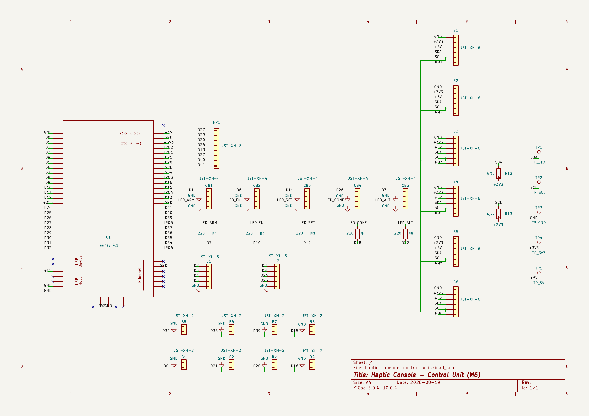
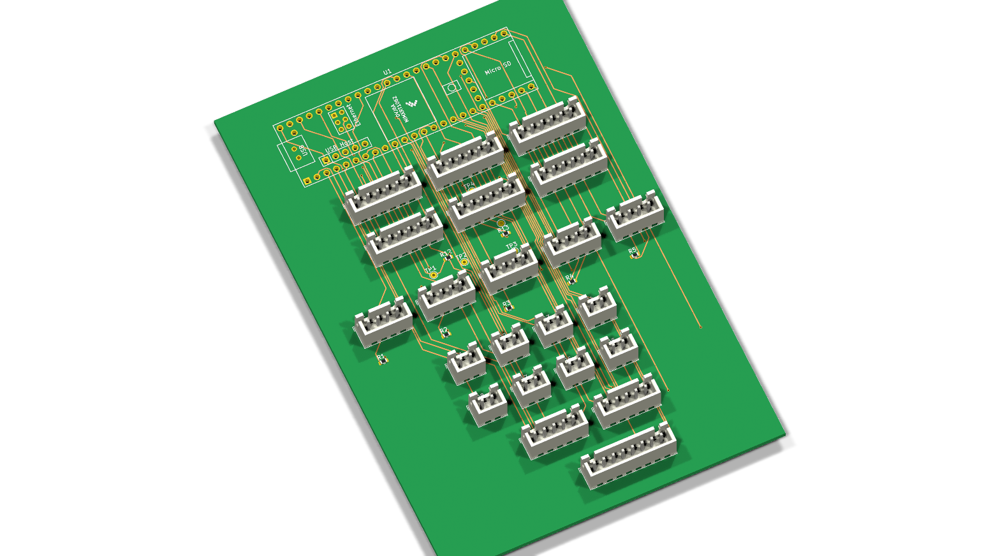
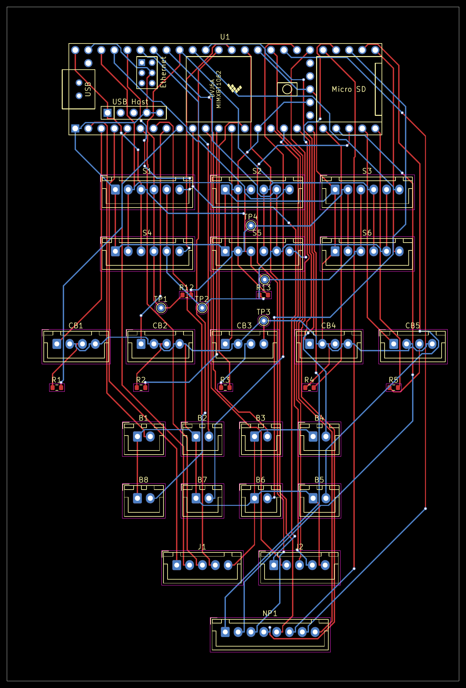
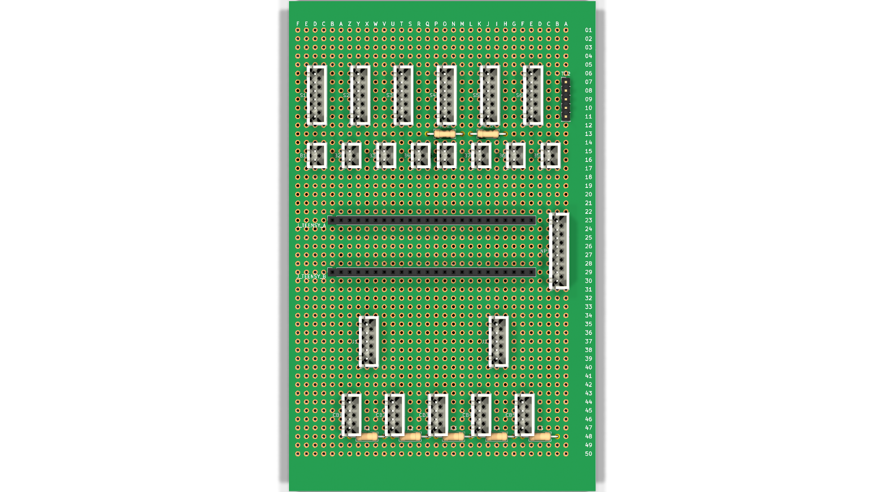

# Haptic Console — Control Unit (M6) KiCad Project

KiCad project for the Control Unit module of the Haptic Console v1.0. One schematic,
two PCBs: a compact manufactured board (SMD, routed, ready for fab) and a hand-wireable
perfboard build.

## Schematic

U1 Teensy 4.1, S1–S6 haptic driver connectors (6-pin JST-XH, [XH2.54 v1.1 standard](#connector-standard)),
B1–B8 tactile buttons, CB1–CB5 + R1–R5 LED/button conditioning, R12/R13 I²C pull-ups,
J1/J2 joystick headers, NP1 numpad matrix, TP1–TP5 test points (SDA/SCL/GND/+3V3/+5V,
tapped at the I²C pull-up network). ERC: 0 errors/0 warnings.

## Manufactured board

Compact (88×131mm) layout, SMD 0603 resistors, fully autorouted (628 track segments,
45 vias, 0 unrouted nets), plus 5 THT test-point pads (TP1–TP5) for SDA/SCL/GND/+3V3/+5V
near R12/R13. DRC: 0 errors/0 warnings, 0 unconnected pads.

Gerbers + drill file: [`project/haptic-console-control-unit-gerbers.zip`](project/haptic-console-control-unit-gerbers.zip)
(Gerber X2 + Excellon drill, plain KiCad-default output — no fab-specific renaming).
View with [gerbv](https://gerbv.github.io/) or unzip and drag into your fab's order-check
tool (JLCPCB/PCBWay/OSH Park all accept the zip directly).

## Perfboard build

Hand-wireable 90×150mm 32×50-hole perfboard layout, same schematic/nets, laid out for
row/column GND+3V3+5V+SDA+SCL bus wiring, with 203 colour-coded back-side jumper wires
modelled in 3D (see [`docs/perfboard-wiring-regeneration.md`](docs/perfboard-wiring-regeneration.md)). TP1–TP5 are real male 2.54mm header pins
(not just pads) in the last column at the board's right edge, past S6 — clip a jumper
or scope hook straight on instead of back-probing a live JST connector. Full
per-connector wiring plan (every connection as a board grid reference, e.g.
`S1.1 → Q23`), live at
**[wiring-guide](https://speedypleath.github.io/control-unit-kicad/wiring-guide.html)**
(source: [`docs/wiring-guide.html`](docs/wiring-guide.html)). Print
[`renders/perfboard-placement-template-1to1.pdf`](renders/perfboard-placement-template-1to1.pdf)
at 100%/Actual Size for physical placement.

## GPIO assignment

Every connector signal is wired to whichever Teensy digital pin sits physically closest
to it, rather than to a contiguous block per function — this cut total hand-wire length
on the perfboard by ~20% (1772 → 1427 mm of Manhattan run, longest single wire 86 → 58 mm)
and the perfboard's jumper count from 268 to 203 segments. The assignments are therefore
**not** sequential; the authoritative map is `scripts/pin_map.json`, rendered per
connector in the [wiring guide](docs/wiring-guide.html) and the
[panel wiring guide](docs/panel-wiring-guide.html). Firmware pin constants must follow
that map.

## Connector standard

S1–S6 haptic-module cables follow **XH2.54 6-pin — Haptic Console Connector Standard
v1.1**: pin 1 GND, pin 2 3.3V, pin 3 5V, pin 4 SDA, pin 5 SCL, pin 6 IRQ.

## Libraries

- `teensy.pretty` / `teensy.kicad_sym` — XenGi Teensy 4.1 footprint + symbol (not stock
  KiCad), vendored in `libraries/`.
- `Connector_JST`, `Resistor_THT`, `Resistor_SMD`, `Device`, `Connector_Generic`, `power`
  — stock KiCad 10 libraries.
- `digikey-kicad-library`, `SparkFun-KiCad-Libraries` — additional atomic parts.
- Project `fp-lib-table` / `sym-lib-table` wired for all of the above.

## Files

- `project/` — schematic, both boards, project files, lib tables, `gerbers/` +
  `*-gerbers.zip` (manufactured board fab output)
- `libraries/` — vendored XenGi `teensy.pretty`
- `renders/` — schematic + PCB renders
- `docs/` — wiring guide, build log, kicad-mcp lessons

## Sources

- Teensy 4.1 footprints: https://github.com/XenGi/teensy.pretty
- Digi-Key atomic parts: https://github.com/Digi-Key/digikey-kicad-library
- SparkFun: https://github.com/sparkfun/SparkFun-KiCad-Libraries
- KiCad stock footprints: https://gitlab.com/kicad/libraries/kicad-footprints
